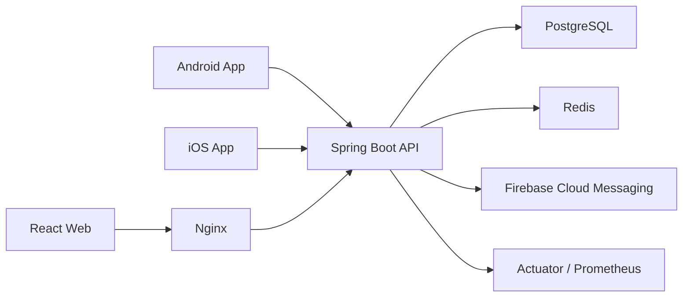

# 싸브리타임

싸브리타임은 SSAFY 교육생을 위한 캠퍼스 생활 통합 커뮤니티 서비스입니다. 교육생 인증을 기반으로 익명 게시판, 팀·스터디 모집, 포트폴리오, 쪽지/채팅, 알림, 디데이 같은 교육 과정 중 자주 필요한 기능을 하나의 앱에서 제공합니다.

## 서비스 목표

SSAFY 교육생은 프로젝트 팀 빌딩, 스터디 모집, 캠퍼스 정보 확인, 공지 공유, 포트폴리오 관리처럼 반복적으로 필요한 활동을 여러 채널에 흩어져 처리합니다. 싸브리타임은 이 흐름을 한곳으로 모아 교육생 간 연결과 정보 탐색을 더 빠르게 만드는 것을 목표로 합니다.

## 주요 기능

### 회원 및 인증

- SSAFY 교육생 인증 기반 회원 가입
- 로그인, 로그아웃, 아이디 찾기, 비밀번호 재설정
- 마이페이지에서 내 정보, 작성글, 댓글, 스크랩 관리
- 포트폴리오 생성, 조회, 수정, 삭제
- 기술 스택, 프로젝트 경험, 희망 포지션, SW 역량 정보 관리

### 커뮤니티

- 자유 게시판, 프로젝트 홍보, 설문, 장터, 취업 공고, 질문 등 게시판 운영
- 게시글 작성, 조회, 수정, 삭제
- 이미지 첨부, 투표 첨부, 댓글/답글
- 익명 작성과 닉네임 작성 선택
- 공감, 인기글, 검색, 스크랩
- 신고 누적 기반 블라인드 처리
- 공지사항 관리

### 팀·스터디 관리

- 프로젝트 팀과 스터디 생성, 목록 조회, 상세 조회, 수정, 삭제
- 지원서 작성, 지원 현황 조회, 승인/거절
- 팀장/스터디장 전용 멤버 관리
- 팀·스터디 공지사항과 할 일 관리
- 내 그룹, 내 지원 현황, 진행률 확인
- 포트폴리오 기반 지원자 확인

### 편의 기능

- 캠퍼스 정보와 길찾기 흐름 지원
- 교육생 간 쪽지 및 1:1 채팅형 메시지
- 공통 일정과 개인 일정 기반 디데이
- 문의하기, 이용 안내, 커뮤니티 이용 규칙
- 다크 모드 등 사용자 설정

### 알림

- Firebase Cloud Messaging 기반 푸시 알림
- 댓글, 팀/스터디 가입 신청, 일정성 알림
- 앱 내 알림 목록 및 알림 상세 확인
- 알림 수신 설정

## 기술 스택

| 영역 | 기술 |
| --- | --- |
| Backend | Java 21, Spring Boot, Spring Security, Spring Data JPA, WebSocket/STOMP, Spring Validation |
| Database / Cache | PostgreSQL, Redis |
| API / Docs | REST API, Springdoc OpenAPI |
| Notification | Firebase Admin SDK, Firebase Cloud Messaging |
| Web Frontend | React, TypeScript, Vite, Axios, React Router, STOMP/SockJS |
| Android | Kotlin, Jetpack Compose, Retrofit, OkHttp, Room, Firebase Messaging, Coil |
| iOS | Swift, SwiftUI, URLSession, Firebase Messaging |
| Infra | Docker Compose, Nginx, Grafana, Prometheus, Loki, Promtail, Netdata |

## 서비스 구조



## 프로젝트 구조

```text
.
├── android/      # Android Jetpack Compose 앱
├── iOS/          # iOS SwiftUI 앱
├── frontend/     # React + Vite 웹 클라이언트
├── backend/      # Spring Boot API 서버
├── nginx/        # Nginx reverse proxy 설정
├── monitoring/   # Grafana, Prometheus, Loki, Promtail 설정
├── exec/         # 배포 및 운영 보조 문서/스크립트
└── docs/         # 프로젝트 문서
```
