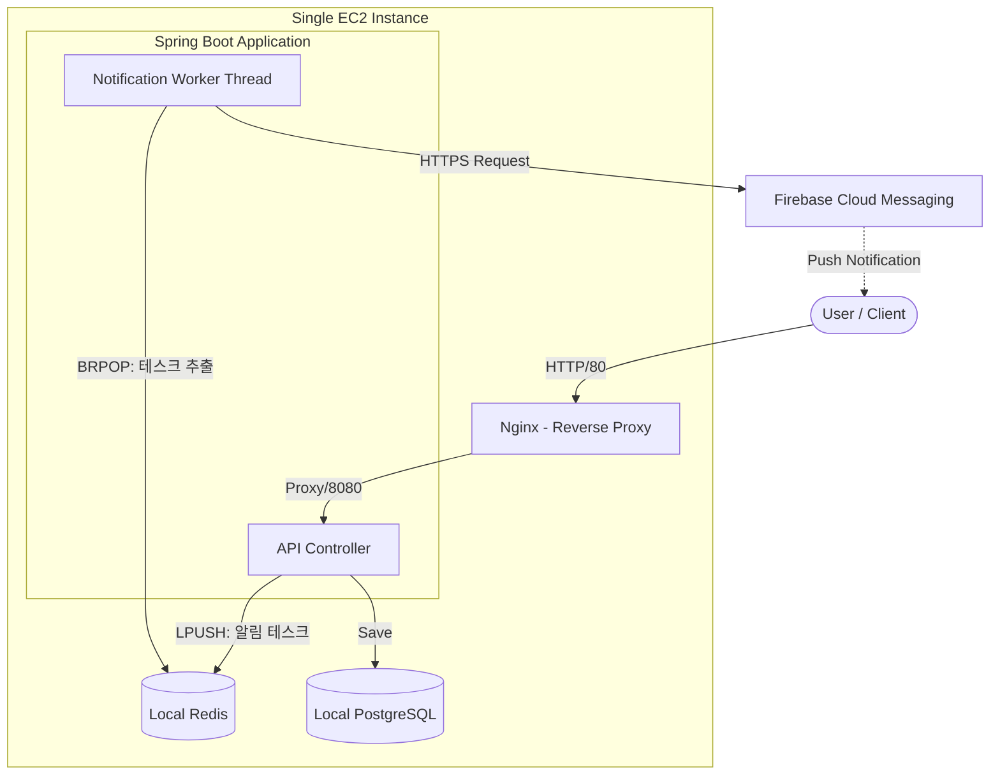

# architecture.md

inital architecture of backend service.

```mermaid
graph TD
    %% 외부 엔티티
    User([User / Client])
    FCM[Firebase Cloud Messaging]

    subgraph EC2_Instance [Single EC2 Instance]
        %% 입구
        Nginx[Nginx - Reverse Proxy]

        %% 애플리케이션 (논리적 분리)
        subgraph Spring_Boot_App [Spring Boot Application]
            API[API Controller]
            Worker[Notification Worker Thread]
        end

        %% 데이터/메시지 레이어
        Redis[(Local Redis)]
        DB[(Local PostgreSQL)]
    end

    %% 흐름 정의
    User -->|HTTP/80| Nginx
    Nginx -->|Proxy/8080| API

    %% 내부 로직
    API -->|Save| DB
    API -->|LPUSH: 알림 테스크| Redis
    
    %% 비동기 처리
    Worker -->|BRPOP: 테스크 추출| Redis
    Worker -->|HTTPS Request| FCM
    FCM -.->|Push Notification| User
```